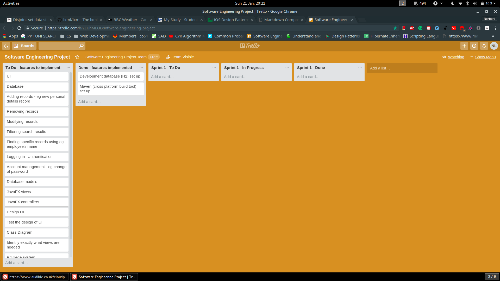
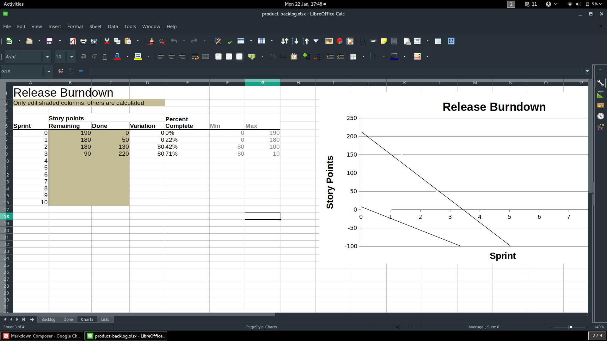

# Stage 2 

## Meeting Outline

- The priority of this stage is the **planning documents**. (We are not expected to code at this stage)
- Develop plans for how we will organise (see "Planning" below) 
- **what documents we'll keep track of** (see "Project management" below)
- We need to start thinking about the **structure of the app** (not the priority - we will not get penalised for not completing this)
- We need to review the use case diagrams they gave us and correct them (do we need scenarios again?)
  * google doc for everyone to contribute ideas
- Decide what is the most important (ie what to tackle first - see Scrum below) 

## Scrum

</img>

### The Team

- [ ] **Scrum Master** (?)
  + **The Scrum Master** 
	+ often considered a coach for the team, helping the team do the best work it possibly can
	* responsible for making sure a team lives by the values and practices of Scrum
- [ ] **Product Owner** (?)
  + typically a project's key stakeholder
  + has a vision of what he or she wishes to build
  + convey that vision to the scrum team

### Items

- [ ] We need a product backlog 
  + identify all features (each 5 - 15h roughly)
  + put them in a table 
  + add ratings of effort 
  + add ratings of the return of time investment

- [ ] We need to plan the first iteration (aka sprint in Scrum)
  + decide what features from the product backlog go into this particular sprint
  + look into the product backlog for features with higest time investment return
  + use a system (eg Trello or Excel - Google Sheets - see picture below) to split the features amongst ourselves 
	* this will let us assign names to each task and keep track of what has been completed and what is left to do
  + construct a **sprint backlog** for the first sprint (Trello?) 

#### Trello (for spring backlog)

 </img>

#### Excel Spreadsheet (for product backlog)

 </img>

## Planning (name of each document, describe processes involved, purpose of each document)

### Project management

For any documents to be completed by more than one person we can use
Google Docs

We will work on it during workshops and in our own time according to the
tasks distributed in the sprint backlog.

FaceBook to stay in touch / deal with immediate issues.

+ [ ] meeting notes (currently in <a href="https://github.com/nl253/Software-Engineering-Project/tree/master/doc/meetings">here (GitHub)</a>)
  - table ?
+ [ ] GANTT chart
+ Agile (Scrum)
  - [ ] product backlog
  - [ ] sprint backlog
	+ Trello to split tasks during each sprint (?) 
	+ We could also use an excel spreadsheet (google sheets)

### QA

### Reviews

Meetings once a week (with notes summarising what was discussed)

### Version Control

- **Git(lab)**
  + We all need to make sure we can use Git
- Once we will agree on the class structure I will change the code + upload it

### Software Tests

- **JUnit5** (API is essentially the same as JUnit4 tests are in [here](../../src/test/java))
- I've already set everything up (JUnit dependency in [pom.xml](../../pom.xml))
  + **Maven** should be able to run the tests (see if everyone can get it to work)
- Bug ("issue") tracking system on GitLab (see [out GitLab issue page](https://git.cs.kent.ac.uk/co510/25b/issues))

## Structure

- start working on the class diagram 
- we'll likely use Model-View-Controller
  + used in the CodeIgniter coursework
  + standard for building UIs - you separte view (presentation of the data) from the logic
  + possibly split it into models, controller and the rest (see below)
- discuss it in light of the design patterns from Olaf's lecture

</img>

- `Reviewer` interface ? (which `Manager` and `Director` and `HREmployee` would implement)
- `Manager` is a generalization of an `Employee`
- so is `Director`
- Many records - how about an abstract `BaseRecord` class from which they all inherit
- Many recommendations - how about an abstract `BaseRecommendation` class from which they all inherit

### People - Employee, Manager, Director (Possible Design)

</img>

### Recommendations - Probation, Salary Increase, Remain, Promotion, Termination (Possible Design)

</img>
 
